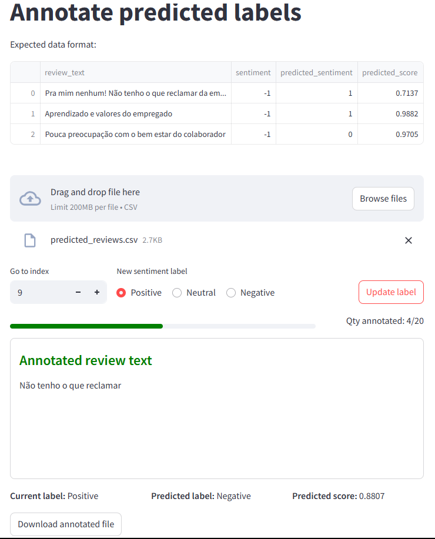

# Sentiment Annotation Tool




A web-based tool for annotating sentiment labels of Glassdoor reviews using Streamlit. This project provides two modes:

- **Prediction Annotation**: For reviewing and correcting model-predicted sentiment labels.
- **Manual Annotation**: For assigning sentiment labels manually, without any predictions.

Inspired by [Streamlit Named Entity Recognition (NER) Annotation component](https://github.com/prasadchandan/st_ner_annotate).

---

## Project structure

- `Prediction_Annotation.py`: Annotate datasets that already contain model predictions.
- `pages/Manual_Annotation.py`: Manually annotate sentiment for datasets without predictions.

## Sample datasets

Sample CSV files are provided for quick testing and demonstration:

- [`sample_datasets/predicted_reviews.csv`](sample_datasets/predicted_reviews.csv): Use with `Prediction_Annotation.py` (contains model predictions).
- [`sample_datasets/raw_reviews.csv`](sample_datasets/raw_reviews.csv): Use with `pages/Manual_Annotation.py` (raw reviews, no predictions).

You can upload these files directly in the app to try out the annotation workflows.

---

## How to use

### 1. Requirements
- Python 3.8+
- Install dependencies:
  ```bash
  pip install -r requirements.txt
  ```

### 2. Running the App
From the project root, run:
```bash
streamlit run Prediction_Annotation.py
```

### 3. Accepted file format
#### For `Prediction_Annotation.py`:
Your CSV file must contain the following columns:
- `review_text`: The text to annotate
- `sentiment`: The true (or initial) sentiment label (integer: 1=Positive, 0=Neutral, -1=Negative)
- `predicted_sentiment`: The model's predicted sentiment (integer: 1=Positive, 0=Neutral, -1=Negative)
- `predicted_score`: The confidence score of the prediction (float)

#### For `pages/Manual_Annotation.py`:
Your CSV file must contain:
- `review_text`: The text to annotate
- `sentiment`: The original sentiment

### 4. Annotating
- Use the navigation and radio buttons to assign or correct sentiment labels.
- Progress and annotation status are displayed.
- Download your annotated file using the provided button. The file will include your changes and a `reviewed` flag.
- In manual mode, an `annotated_sentiment` column will be created/updated with your choices.
